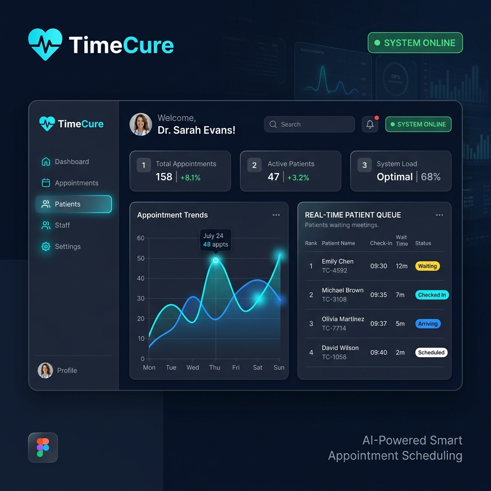

# 🏥 TimeCure — AI-Powered Smart Appointment Scheduling



[](https://cortex-crew-time-cure.vercel.app)
[](https://github.com/Jivan-Patel/CortexCrew_TimeCure)
[](https://opensource.org/licenses/ISC)

> **TimeCure** is a next-generation healthcare productivity platform that combines **Machine Learning** with **Real-Time Event Streams** to eliminate hospital waiting times and optimize doctor utilization.

---

## 🚀 Key Features

### 🤖 Dual-AI Engine
- **Consultation Time Prediction**: A regression model that predicts exact consultation durations based on patient history, age, and visit type.
- **No-Show Intelligence**: A classification model that calculates the probability of a patient missing their appointment, allowing for dynamic overbooking and slot optimization.

### 🔄 Real-Time Queue Management
- **Live Sync**: Instant updates for doctors, receptionists, and patients as consultations start, end, or get delayed.
- **Dynamic wait times**: Patients see their estimated wait time shift in real-time based on actual clinic throughput.

### 📱 Smart SMS Reminders
- **Risk-Based Triggering**: High-risk patients (predicted by ML) receive multi-stage reminders to ensure attendance or early cancellation.

### 📊 Analytics Dashboard
- Deep insights into clinic efficiency, average delay trends, and no-show distributions.

---

## 🛠️ Tech Stack

| Layer | Technologies |
| :--- | :--- |
| **Frontend** | React 19, Vite, Tailwind CSS 4, Framer Motion, Lucide, Recharts |
| **Backend** | Node.js 22, Express, MongoDB, JWT Authentication |
| **ML Service** | Python 3.12, Flask, Scikit-Learn, Pandas, NumPy |

---

## 📁 Project Structure

```text
CortexCrew_TimeCure/
├── frontend_v2/        # React + Vite application
├── backend/            # Node.js + Express API
├── ml/                 # Python Flask ML Service & Models
├── TimeCure-backend/   # Node.js + Express
├── assets/             # Branding and Documentation imagery
└── README.md           # Project Documentation
```

---

## ⚙️ Local Setup & Installation

### 1. Backend Setup (Node.js)
```bash
cd backend
npm install
```
Create a `.env` file in the `backend` folder:
```env
PORT=3000
MONGO_URI=your_mongodb_connection_string
JWT_SECRET=your_jwt_secret
```
Run the server:
```bash
npm start
# or node server.js
```

### 2. ML Service Setup (Python)
```bash
cd ml
python -m venv venv
source venv/bin/activate  # On Windows: venv\Scripts\activate
pip install -r requirements.txt
python app.py
```

### 3. Frontend Setup (React)
```bash
cd frontend
npm install
npm run dev
```

---

## 🔐 Authentication & Roles
- **Patient**: Book appointments, view live queue, and receive reminders.
- **Doctor**: One Time SignUp, Start/End consultations, view patient history, and see real-time delay metrics.

---

## 🏆 The "Cortex Crew" Vision
*“Our system combines machine learning predictions with event-driven real-time updates to dynamically optimize patient scheduling and minimize waiting time.”*

---

## 📄 License
This project is licensed under the **ISC License**.

---
